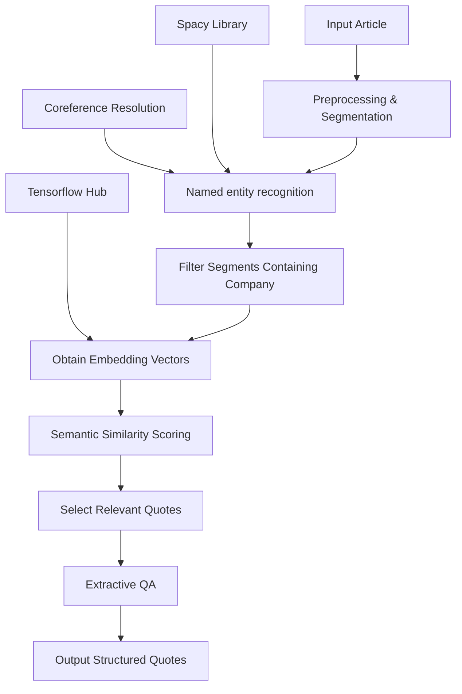

# Quote Extraction

## Core task: extracting answers for certain questions from articles

## **Data preprocessing**

Some rows are just “content requires subscription”, and some other rows contain messed up formats. I have to clean the whole dataset before moving on.

Basically, I set up those standards to filter invalid entries:
1. each line should only contain 4 elements, which are id, content, company_name and entry_id.
2. id and entry_id should only consist of numbers and lowercase letters.

The preprocessing script is in csv_preprocessing.py. After running the script, I was left with 4135 entries.

## **Method 1:Deepseek**

Since its release in 2025 March 24th, Deepseek V3-0324 has been proven to be a cheap alternative for SOTA non-thinking LLMs
such as GPT-4.1 or claude 3.7 Sonnet, while having similar performances. In this project, I will use
Deepseek to extract quotes for me by calling [Deepseek api](https://api-docs.deepseek.com/).

The reason I chose a non-thinking LLM is thinking LLMs, such as Deepseek-R1-0528 or Gemini 2.5 Pro tend to "overthink" 
and hallucinate non-existent quotes while performing simple tasks such as parsing articles.
Apart from hallucinations, thinking LLMs are also worse at following instructions such as "Your output must be in JSON format."
While non-thinking LLMs can follow this instruction hundreds of times in a row without failing once, 
thinking LLMs fail quite often.

This is my initial system prompt:

    You are a professional market analyst. You are asked to process certain articles to extract answer for certain questions.
    
    In the prompt, you will be given an article and the name of a company. You shall extract quotes from the article related to those three questions:

    1. The company has mentioned/announced that it will stop its business in Russia. Note that this one is about what companies say, not necessarily what companies actually do.

    2. The company has largely maintained its sales in Russia. Note that this one is about the action, not what companies say.

    3. The company has continued to export its products to Russia. Note that this one is about the action, not what companies say.

    The quotes should directly answer those questions; if not, the answer must be inferable from the quote.

    Your answers shall only contain quotes to those answers. The quotes shall be strictly copies from the original text, without any modifications.

Then I entered the following user prompt:

>company:
>basf
>
>article:
>BASF strongly condemns the Russian war of aggression against Ukraine. We stand in solidarity with the people of Ukraine and hope that this war will end as soon as possible. In response to the war, the company has wound down its activities in Russia and Belarus. One exception is the business to support food production - a measure to ensure security of supply for agricultural products and, in particular, to enable poorer countries to continue to have access to inexpensive food. In 2022, BASF supported both the Red Cross and Ukrainian refugees through donation campaigns and emergency aid. In addition, a crisis team continues to support BASF employees in Ukraine. BASF to wind down activities in Russia and Belarus except for business that supports food production. As announced on March 3, 2022, BASF has not conducted new business in Russia and Belarus, in light of the war of aggression against Ukraine ordered by the Russian government. BASF and its employees donate an additional €4.2 million for people in Ukraine. 2,110,156 €: This is how much BASF employees donated to the BASF Stiftung (BASF Foundation) as part of the company-wide initiative #ColleaguesForUkraine – by far the highest result of an employee donation campaign in BASF's history. The company will double the amount. BASF donates €1 million in emergency humanitarian aid to Ukraine. Following the attack on Ukraine ordered by the Russian government, the civilian population is suffering from the escalating violence. Hundreds of thousands are on the run. To help the people in the country, BASF has provided €1 million in emergency aid.

And Deepseek gave the following output:


>1. "In response to the war, the company has wound down its activities in Russia and Belarus."  
   "BASF to wind down activities in Russia and Belarus except for business that supports food production."  
   "As announced on March 3, 2022, BASF has not conducted new business in Russia and Belarus, in light of the war of aggression against Ukraine ordered by the Russian government."  

>2. "One exception is the business to support food production - a measure to ensure security of supply for agricultural products and, in particular, to enable poorer countries to continue to have access to inexpensive food."  

>3. "One exception is the business to support food production - a measure to ensure security of supply for agricultural products and, in particular, to enable poorer countries to continue to have access to inexpensive food."

Which seems decent.

Then I tried to force the output in Json format, so the outputs can be processed by automated scripts.

This gave the following output: 

```json
{
  "1": [
    "In response to the war, the company has wound down its activities in Russia and Belarus.",
    "BASF to wind down activities in Russia and Belarus except for business that supports food production.",
    "As announced on March 3, 2022, BASF has not conducted new business in Russia and Belarus, in light of the war of aggression against Ukraine ordered by the Russian government."
  ],
  "2": [
    "One exception is the business to support food production - a measure to ensure security of supply for agricultural products and, in particular, to enable poorer countries to continue to have access to inexpensive food."
  ],
  "3": []
}
```
which is good.

However, sometimes the character ” would appear as ” in the output. I found out that
this is due to opening an utf-8 encoded file as a latin-1 encoded file, so I implemented an
function that re-encodes the input file as UTF-8, and the problem was solved.

Then, I wrote a program to automatically reads from csv files and invokes deepseek
api, then writes out found quotes to a separate csv file, which is structured like this:

### **Output structure**

```
| id | content | company_name | entry_id | question_1 | question_2 | question_ 3 |
----------------------------------------------------------------------------------
|    |         |              |          |            |            |             |

```
>Question 1 corresponds to quotes for "(Name of company) has mentioned/announced that it will stop its business in Russia."
> 
>Question 2 corresponds to quotes for "(Name of company) has largely maintained its sales in Russia."
> 
>Question 3 corresponds to quotes for "(Name of company) has continued to export its products to Russia."

If multiple quotes are found for one question, each quote is surrounded by
single quotation marks, and quotes are separated by the newline character '\n'.

So the quotes are similar to this structure:

```
'quote 1'
'quote 2'
'quote 3'
...
```

### Problem encountered: unspecified result

After some testing, I found out that the output quotes are related to all companies
present in the article, rather than related to a single company. It turns out that I forgot to
include the name of the company in my prompt. So I added the company name in the prompt
and everything is fixed.

I also made small modifications to the system prompt to make the whole inference process more robust.
The updated system prompt is in Prompts/system_prompt.txt.


## **Method 2: Sentence Embedding + Semantic Analysis**

I tried another method: Sentence Embedding.

Sentence embedding converts a sentence into a vector in high dimensional space,
so we can search for answers of the questions by calculating the similarity of the 
embedding vectors of sentences in the article and the embedding vector of query sentence.

However, this method has a lot of limitations. For example, for the query sentence below,

>AGC has mentioned/announced that it will stop its business in Russia.

The embeddings gave a similarity of 0.4 on the sentence

>Glass giant AGC Inc. said on Feb. 8 that it started considering selling its glass manufacturing and sales operations in Russia.

and gave a similarity of 0.48 on the sentence

> AGC has two plants in Russia.

While it is clearly visible that the former sentence is more related to the question.

Each embedding only carry the meanings of that exact sentence without any context.
This can be problematic since we have to infer its meaning from the context for
sentences similar to "This company has stopped exporting its products to Russia."

After doing some research, I came up with a possible solution that uses a combination
of named entity extraction, sentence embedding and extractive QA, along with coreference
resolution. 

Basically, the workflow looks like this:


### Coreference Resolution

Coreference Resolution replaces coreferences with names of objects.
For example, in the sentence "The dog is happy. It is running fast",
coreference resolution models replaces "It" with "the dog".

Unfortunately, there isn't any reliable Coreference Resolution 
library that supports Russian and Ukrainian, so I have to skip this part.

### Named Entity Extraction

Named entity extraction models extract entities from an article. For example,
for the SpaCy library I use, an example output looks like this:

```
Name                 |Tag      |Start/End
------------------------------------------
japan                GPE        10 15
Japanese             NORP       51 59
Russia               GPE        98 104
The Asahi Shimbun: Breaking News ORG        107 139
Japan News           ORG        141 151
Analysis             ORG        156 164
Japanese             NORP       165 173
Russia               GPE        212 218
February 24, 2023    DATE       237 254
Uniqlo               ORG        270 276
Moscow               GPE        303 309
April 10, 2022       DATE       335 349
Hitoki Nakagawa      PERSON     352 367
one-year             DATE       376 384
Ukraine              GPE        416 423
Japanese             NORP       425 433
```
Name is the name of the entity, tag indicates the type of the entity, and
Start/End indicates where the entity appears in the article.

Because we are looking for companies, I first filter out non-companies by
choosing entities that has the "ORG" tag, which leaves me with organizations.

Then, I use fuzzy matching to select entities that are most possibly
related with
the company that we are interested in. Fuzzy matching measures the 
similarity between two words. For example, "AGC INC." and "AGC" have
high similarity, but "AGC" and "Sony" have low similarity.

For example, if I want to know where the company 'agc' appears in 
a list which looks like this will be returned:

```
Name                 Tag        Start/End
------------------------------------------
AGC Inc.             ORG        952  960
AGC                  ORG        1324 1327
AGC                  ORG        1488 1491
```

Then, I can select sentences that contains the name of organizations,
and use Extractive Question Answering to verify if the selected 
sentences contain the answer.

In Extractive QA, a score is calculated for each pair of question
and answer. A higher score indicates higher relevancy for the answer.
Therefore, I can select the most relevant quotes based on their 
scores.

I have implemented this workflow in parse_article_embedding.py,
embedding.py and language_router.py. 

### Limitations

This method has its limitations compared to LLMs. First of all, because there are no NLP libraries
for certain languages, such as Persian and Croatian, I have to skip some articles.
Secondly, even with the combination of entity extraction and Extractive QA,
the boundary between "good answers" and "bad answers" is still ambiguous.
So by having stricter limitations for the quotes, this workflow would
inevitably discard some quotes that are actually related to the questions.
LLMs, on the other hand, are much more adaptive, knowing when to include 
quotes in answers and when to exclude them.

## Translation

I used Google Translate API to translate the quotes.

### **Output structure**

```
| id | content | company_name | entry_id | question_1 | question_2 | question_3 | question_1_translated | question_2_translated | question_3_translated | source_language | translated |
----------------------------------------------------------------------------------------------------------------------------------------------------------------------------------------
|    |         |              |          |            |            |            |                       |                       |                       |                 |            |

```
>"source_language" corresponds to the source language of the quotes, in ISO 639 language codes.
> 
>"translated" corresponds to if the quotes are translated. 
> 1 means true and 0 means false.
> 
>"question_1_translated", "question_2_translated", "question_3_translated"
> corresponds to translated quotes of question1, question2, question3,
> respectively. If the original quotes are not translated (which means the
> original quotes are English), those fields are left blank.


## Summary

In conclusion, I implemented a workflow that can extract quotes related to
certain questions from an article, using LLM and non-LLM methods. 


